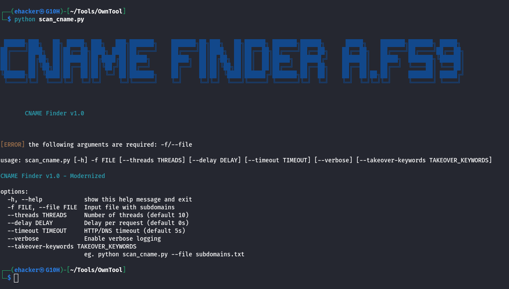

<div align=center>

# 🌐🔍 CNAME Scanner



<a name="top"></a>
⚠️ **Disclaimer:** Results from this scanner may include false positives or negatives. Always manually verify potential subdomain takeover findings before taking any action.

A powerful Python tool for scanning subdomains to detect CNAME records and identify potential subdomain takeover vulnerabilities. This script performs DNS resolution, HTTP checks, and vulnerability detection using configurable keywords and service fingerprints.

</div>

## Features

- **DNS CNAME Resolution**: Queries CNAME records for each subdomain using DNS resolution.
- **Subdomain Takeover Detection**: Identifies potential takeover risks based on customizable keywords and known vulnerable service fingerprints (e.g., AWS S3, GitHub Pages, Heroku).
- **HTTP/HTTPS Status Checks**: Performs requests to check HTTP status codes and final URLs after redirects.
- **Multi-threaded Scanning**: Utilizes ThreadPoolExecutor for concurrent processing to improve performance.
- **Colorized Output**: Provides visually appealing console output with color coding for different statuses.
- **Flexible Output Formats**: Saves results to a text file for dangerous findings and a full CSV for all data.
- **Configurable Options**: Supports custom threads, delays, timeouts, and takeover keywords.
- **Verbose Logging**: Optional detailed logging for debugging and monitoring.

## Requirements

- Python 3.x
- Required Python libraries:
  - `requests` (for HTTP requests)
  - `dnspython` (for DNS resolution)
  - `colorama` (for colorized output)

### Installation

1. Clone the repository:

   ```bash
   git clone https://github.com/Ar-jun-fs9/subdomain-cname-finder.git
   cd subdomain-cname-finder
   ```

2. Install dependencies:
   ```bash
   pip install requests dnspython colorama
   or
   pip install -r requirements.txt
   ```

## Usage

Run the script with the following command:

```bash
python scan_cname.py -f <input_file> [options]
```

### Command-Line Arguments

- `-f, --file <file>`: Path to the input file containing subdomains (one per line). **Required**.
- `--threads <int>`: Number of threads for concurrent scanning (default: 10).
- `--delay <float>`: Delay in seconds between requests (default: 0.0).
- `--timeout <int>`: Timeout in seconds for HTTP/DNS requests (default: 5).
- `--verbose`: Enable verbose logging for detailed output.
- `--takeover-keywords <list>`: Comma-separated list of keywords to detect takeover risks (default: `amazonaws,elb,herokuapp,github.io,netlify.app,cloudfront.net,azurewebsites.net`).

### Examples

1. Basic scan with default settings:

   ```bash
   python scan_cname.py -f subdomains.txt
   ```

2. Scan with increased threads and verbose output:

   ```bash
   python scan_cname.py -f subdomains.txt --threads 20 --verbose
   ```

3. Scan with custom takeover keywords and delay:
   ```bash
   python scan_cname.py -f subdomains.txt --takeover-keywords "s3.amazonaws.com,github.io,custom.domain" --delay 0.5
   ```

## Output

The script generates the following outputs:

- **Console Output**: Real-time, colorized results showing subdomain, CNAME, IPs, HTTP status, and final URL. Takeover risks are highlighted in red.
- **Dangerous Results File** (`results/danger_only.txt`): Contains subdomains with takeover risks that return HTTP 200 status.
- **Full CSV File** (`results/all_results.csv`): Comprehensive CSV with columns for Subdomain, CNAME, IPs, HTTP Status, Final URL, and Takeover flag.

### Sample Console Output

```
[TAKEOVER] vulnerable.example.com → CNAME: takeover.s3.amazonaws.com IPs: 1.2.3.4 | Status: 200 | Final URL: https://takeover.s3.amazonaws.com
safe.example.com → CNAME: cdn.example.com IPs: 5.6.7.8 | Status: 200 | Final URL: https://example.com
```

### Sample CSV Output

| Subdomain              | CNAME                     | IPs     | HTTP Status | Final URL                         | Takeover |
| ---------------------- | ------------------------- | ------- | ----------- | --------------------------------- | -------- |
| vulnerable.example.com | takeover.s3.amazonaws.com | 1.2.3.4 | 200         | https://takeover.s3.amazonaws.com | True     |
| safe.example.com       | cdn.example.com           | 5.6.7.8 | 200         | https://example.com               | False    |

## Supported Vulnerable Services

The script includes fingerprints for the following services prone to subdomain takeover:

- AWS S3
- AWS Elastic Beanstalk
- AWS CloudFront
- Microsoft Azure App Services
- Microsoft Azure Blob Storage
- GitHub Pages
- Heroku
- Shopify
- Zendesk
- Freshdesk
- Help Scout
- Intercom
- UserVoice
- Unbounce
- ActiveCampaign
- Kajabi
- LeadPages
- Tilda
- Canny.io
- ReadTheDocs
- ReadMe.io
- Surge.sh

## How It Works

1. **Input Processing**: Reads subdomains from the specified input file.
2. **DNS Resolution**: For each subdomain, resolves CNAME records.
3. **Takeover Detection**: Checks CNAME against keywords and fingerprints for potential vulnerabilities.
4. **HTTP Checks**: If no takeover is detected, performs HTTP/HTTPS requests to get status and final URL.
5. **Result Processing**: Collects and displays results, saving to files.
6. **Summary**: Prints a summary of scan statistics.

## License

This project is licensed under the MIT License - see the [LICENSE](LICENSE) file for details.

<div align="center">
   
  **[⬆ Back to Top](#top)**
  
</div>
